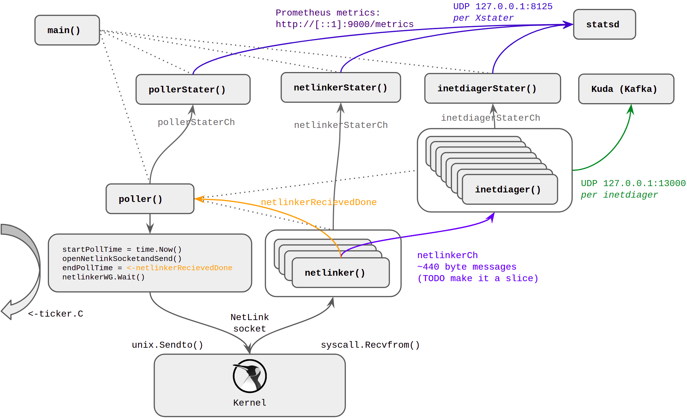
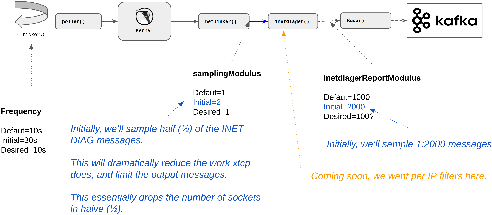

# xTCP

<!--
Markdown quick reference
 https://daringfireball.net/projects/markdown/syntax#link 
-->

----

The `xtcp` stands for:
- e`X`port TCP
- e`X`plore TCP
- `X`ray TCP

`xtcp` is a tool for extracting kernel TCP INET_DIAG data at high rates and exporting that data via protobufs.

Think of `xtcp` like a fast and lightweight version of `ss --tcp --info -n`.
On a machine with a large number of sockets like ~120k, the netlink 
messages are ~5-6MB, but the output of `ss` is about ~60MB.  The output of 
"ss" is also pretty difficult to parse, because of inconsistent key:value 
usage, which was a key motivation for creating this tool.  e.g. This tool is 
more efficient than parsing the output of `ss`.

`xtcp` runs in a polling loop, sending TCP INET_DIAG dump requests, parses the responses, and can selectively send UDP encapsulated protobufs of all the socket data.

`xtcp` is fast and lightweight:
- Written in Golang
- Reads from the kernel in 32KB chunks by default, unlike `ss` which does ~3KB by default. This minimizes system calls.
- Concurrent:
  - netlink socket reads to drain the data out of the kernel as quickly as possible (4 workers for IPv4, and 2 workers for IPv6 by default)
  - netlink message parsing (10 workers for IPv4, and 4 workers for IPv6 by default)
  - metrics summarization

Please note that this tool simply selects randomly which sockets to stream data for, and does NOT trace indiviual sockets overtime (or is really unlike to anyway). e.g. https://github.com/m-lab/tcp-info is a better tool for closely monitoring a small number of sockets, because it has much higher frequency polling, and calculates differences between each polling loop.

`xtcp` exposes detailed metrics for monitoring it's behavior, and has many CLI flags to allow tuning.
- `xtcp` has detailed Prometheus metrics at http://127.0.0.1:9000/metrics by default
- `xtcp` also sends most statistics via statds, which can be disabled

**Supports Linux only because of Netlink sockets.  Have not tested other 
platforms.**


# Overview
Overview of the steps `xtcp` performs:
1. `poller` opens netlink sockets (IPv4 + IPv6)
2. `poller` sends netlink TCP diag request to dump all sockets in the protocol family (IPv4 and IPv6 separately)
3. `netlinker` workers receive netlink response messages and split those into smaller inetdiag messages
4. `inetdiagers` workers parse the smaller messages and put them into the protobuf
5. Protobuf gets sent via UDP to the Kafka bus.
6. `pollerStater, netlinkerStater, inetdiagStater` perform statistics summarization for Prometheus & StatsD



 ## xtcp.go main()
Handles the cli flags, can enable profiling, and spawns a `poller` for each protocol family that is enabled.

Key goroutine workers are:
- `poller`
- `netlinker`
- `inetdiager`
- `pollerStater, netlinkerStater, inetdiagStater`

### Layers

- xtcp.go > poller(IPv4) > netlinker > inetdiager
- xtcp.go > poller(IPv6) > netlinker > inetdiager

## Poller
The `poller` is run as a goroutine once per address family. e.g. There are normally two (x2) of these running at all times.

As described above, there's a small amount of setup, to open their own netlink socket, and to build the address family specific netlink diag dump request.  Please note we are using unsafe here, but this is the only place in the code (well, except for golang maps which use unsafe under the hood).

Then `poller(s)` run the main `time.NewTicker` loop that sends the netlink INET_DIAG dump request.  Within the loop, goroutines for the `netlinker` and `inetdiager` workers are spawned, and `poller` will manage shutting down, or not, the of the `inetdiager` workers between polling loops.  Please keep in mind that essentially the send of the netlink dump request is really what makes the entire `xtcp` do anything.

Setup steps:
1. Build the per address family netlink dump request message.  The dump request asks for everything about the socket.
2. Opens the netlink socket.  Because there is a poller per address family, there is also a socket per family.
3. If the poller is IPv6, it sleeps for half (1/2) the polling frequency, so that polls and processing are off set from IPv4.  This is to make the overall load on the hosts more even.
4. Starts the `time.NewTicker`
 
Then loops:
1. Create channels and workers as required, if they are not already running
2. Records the start time: `startPollTime = time.Now()`
3. Sends the netlink dump request
4. Starts the netlinker workers, passing them the startPollTime
5. Blocks until we receive the end time: `endPollTime = <-netlinkerRecievedDone`
6. Blocks waiting for all the netlinkers to finish ( netlinkerWG.Wait() )
7. Shuts down inetdiagers if requested to do so
8. Sends summary stats to `pollerStater`
9. Blocks waiting for the next time.NewTicker tick: `<-ticker.C`
10. (This is also where we could add a hook for a HTTP request to trigger a poll on demand)

Please note that the `poller` blocks twice (x2) during the polling loop:
- Blocks once waiting to recieve `endPollTime = <-netlinkerRecievedDone`
- Blocks again via a wait group for all the `netlinker`s to complete
This ensures we cannot start the next polling cycle before at least all the netlink messages have been read.  ( Possibly `inetdiager` could still be processing.)

### Timing of the `poller`

There are also timing points to allow monitoring of the system:
```
	var startPollTime time.Time
	var doneReceivedTime time.Time
	var finishedPollTime time.Time

  pollToDoneDuration := doneReceivedTime.Sub(startPollTime)
  pollDuration := finishedPollTime.Sub(startPollTime)
```
The Prometheus metrics have detailed poller duration summary histograms.  e.g. The following is the IPv4 poll duration summary.
```

$ curl -s http://127.0.0.1:9000/metrics 2>&1 | grep xtcp_poller_duration_summary | grep v4 | grep \"poll\"
xtcp_poller_duration_summary{af="v4",type="poll",quantile="0.25"} 0.056582379
xtcp_poller_duration_summary{af="v4",type="poll",quantile="0.5"} 0.06033625
xtcp_poller_duration_summary{af="v4",type="poll",quantile="0.75"} 0.060435775
xtcp_poller_duration_summary{af="v4",type="poll",quantile="0.9"} 0.060514099
xtcp_poller_duration_summary{af="v4",type="poll",quantile="0.99"} 0.064200384
xtcp_poller_duration_summary_sum{af="v4",type="poll"} 42.48829283100006
xtcp_poller_duration_summary_count{af="v4",type="poll"} 723
```

To ensure detection of the processing of the polling data being too slow, if the polling cycle `pollDuration` takes more than `contant pollingSafetyBuffer = 0.8` (80%) of the polling frequency ( `pollingFrequencySeconds` ) then a warning message will be emmited.  Additionally, there is a counter metric `"long_poll"` which will increment for the same reason.  It is recommended to configure alarms based on this metric (see Prometheus variable pollingLong).

```
		// Warn if the polling loop is taking more than 80% (constant) of the polling frequency
		if pollDuration > (time.Duration(float64(*pollingFrequencySeconds) * pollingSafetyBuffer)) {
			if debugLevel > 10 {
				fmt.Println("poller af:", af, "\tPOLLING IS TAKING TOO LONG!! WARNING!!")
			}
		}
```

## Netlinkers
The `netlinker` workers receive netlink message back from the kernel and send the INET_DIAG message to the `inetdiager` workers.

In more detail the `netlinkers`:
1. Receive netlink packets ( with a timeout on the recv call )
2. Split those into component netlink inetdiag messages  (~<440 bytes each: IPv4 424, or IPv6 432 on 5.4.0-42)
3. Check for "DONE" or end of packet.  In the case of "DONE", sends the `time.Now()` over the channel back to the poller.
4. Otherwise, put the useful the inet_diag messages in a slice to group them for performance before sending to `inetdiagers`.  Please note that tracing showed that using a single inet_diag message at a time definitely caused lots of context switching between the goroutines, so xtcp batches this up.

( The default netlink receive buffer size is a page size, but a CLI flag is available to allow testing of alternative sizes. )

( TODO Consider using sync pool to avoid repeated memory allocations.  See also: https://dave.cheney.net/high-performance-go-workshop/dotgo-paris.html#using_sync_pool )

Kernel traverses the TCP sockets hash table building the TCP DIAG responses in chunks of 32KB (8 x page size), then  blocks until the userland drains the socket.  This means that the entire dump does not sit in the kernel waiting to be read, instead the table is traversed as the as the data is read, so the exact time data is gathered from each socket changes.  This is why the default configuration is to build an eight (8) by page size buffer = 32KB to read into, which will minimize the number of system calls.

Currently the `netlinkers` send to the `inetdiagers` over a channel which is passes a single (x1) InetDiag message each time.  This is relatively inefficent, so the plan is to move the a slice, or maybe fixed size array, soon.  There is a metric "xtcp_netlinker_blocked" which counts how often this channel is blocked, and a summary histogram "longest_blocked_duration_summary" also shows the duration the maximum duration any netlinker is blocked on sending to the channel.

Please note by "longest", we mean the longest duration the channel was blocked for each netlinker during the netlinker's lifetime. Therefore please be careful to remember that 50th percentile is NOT the 50th percentile of the blocked duration, but the 50th percentile of the longest.

e.g. The following output shows the channel blocked counters and histogram statistics.
```
[Wed Sep 16 20:39:20] :~# curl -s http://127.0.0.1:9000/metrics 2>&1 | grep -v "#" | grep blocked
xtcp_netlinker_blocked{af="v4",id="0"} 9346
xtcp_netlinker_blocked{af="v4",id="1"} 9370
xtcp_netlinker_blocked{af="v4",id="2"} 9338
xtcp_netlinker_blocked{af="v4",id="3"} 9348
xtcp_netlinker_longest_blocked_summary{af="v4",quantile="0.5"} 0.000905675
xtcp_netlinker_longest_blocked_summary{af="v4",quantile="0.99"} 0.001136052
xtcp_netlinker_longest_blocked_summary_sum{af="v4"} 0.004010358
xtcp_netlinker_longest_blocked_summary_count{af="v4"} 4
```

## inetdiagers
The `inetdiagers` are responsible for doing the heavy lifting on parsing the INET_DIAG messages into all the little structs.  We are using specifically NOT using unsafe pointers, but using the more "golang" friendly binary.Read().

Just keeps going.  -> If there are errors parsing, the code will generally ignore this and try to keep going. It does increment a "nastyContinue" counter, which can be exposed to Prometheus to keep an eye on this.

Several of the structures need a little bit more processing which also happens in inetdiagers:
- Func swapUint16 switches around the SocketID.(Source/Dest)Ports because 
  it is __be16
- IP addresses need per family (IPv4/IPv6) special handling. Doing conversion to golang net.IP() type to allow printing here, but we actually use the bytes to put into the protobu
- sndWscale/rcvWscale are both 4 bits in the kernel, so there's a tiny amount of bitwise, to put that into uint32 for the protobuf
- Congestion control algorithm comes as a variable length C string, so we convert that to golang string. Using only the first thee (3) characters, which is mapped to enum in copyTypesToProto()

Once the data has been put into the golang types, the copyTypesToProto() function puts all the data into the protobuf.  There is a little bit of type conversion that needs to happen here because the kernel structures minimize the number of bits, using uint8 for example, while the smallest data type in protobufs is uint32.

### Sampling

There are three (x3) main message sampling/throttling points within `xtcp`:
- Frequency
    - This controls the main lopping loop, or more specifically the duration at which the INET DIAG DUMP messages are sent to the kernel.
    - The more frequent this is the more possibility we have to sample the data, but this does cause the kernel to do some work, so we don’t want it too low.
    - Riptide has been operating at a polling frequency of five  seconds (`5s`) for years, but we would like to target ten seconds (`10s`).
    - For the initial deployment, we’ll start off very gently at `30s`.
    - (Please also note that the IPv6 polling is offset by half (1/2) the polling frequency, so typical polling in frequencies >2s will not occur concurrently)
- samplingModulus
    - samplingModulus controls how many INET DIAG messages get passed from the netlinker to the inetdiager.
    - Sampling here is the earliest point in the xtcp flow that we can start to filter messages.
    - However, this modulus based filter does not allow filtering by IPs because we have not yet decoded the INET DIAG message at all, so filtering here is not really recommended.
    - The intention is to not filter at this point long term, but initially, we’ll filter at a modulus of `2`, mean `1:2` messages will be dropped.  This will have the effect of halving (½) the number of message xtcp needs to process.
- inetdiagerReportModulus
    - inetdiagerReportModulus controls the rate at which the parse INET DIAG messages that get sent to Kuka/Kafka.
    - We’re hoping to slowly increase the rate of messages we send.
    - Initially, we’ll start at a very conservative `2000`, or `1:2000`, but hope to move to `1:1000` pretty quickly, and ramp down further as confidence in the overall system increases.
    - Longer term, we'd like to add more intelligent controls over which sockets are sampled. e.g. Target:
        - Specific customer VIPs
        - Specific last/next hop ASN
        - Inter PoP traffic
        - Intra PoP traffic
        - Origin servers

The following diagram shows the sampling controls:



### Sampling 
e.g. To select all sockets
```
xtcp --frequency 10ms -inetdiagerReportModulus 1 -samplingModulus 1
```

Outstanding security controls:
- NOT chrooted


## Summary
Risk                                        | Mitigation             | Description
---                                         | ---                    | ---
System resources (processes)                | -goMaxProc             | xtcp is limited by default to 4 processes
System resources (processes)                | cgroup                 | Systemd unit file: [xtcp.service](./bundle/systemd/xtcp.service), LimitNPROC=4
System resources (RAM)                      | cgroup                 | Per systemd, MemoryHigh=1500M, MemoryMax=2G
System resources (limits)                   | systemd LimitX         | Per systemd, went to town on the [limits](https://www.freedesktop.org/software/systemd/man/systemd.exec)
System resources (protect)                  | systemd ProtectX       | Per systemd, went to town on the [Protect](https://www.freedesktop.org/software/systemd/man/systemd.exec)
System resources (Nice/Weight)              | systemd Nice/Weight    | Nice = 15, Weight=50 (default=100)
Completely disable the service               | $XTCP_DISABLED        | Env variable should be set to true=`1`, and then `systemctl restart xtcp`
frequency                                   | -frequency             | Env variable XTCP_FREQUENCY or command line -frequency
samplingModulus                             | -samplingModulus       | Env variable XTCP_SAMPLING_MODULUS or command line -samplingModulus
inetdaigerReportModulus                     | -inetdaigerReportModulus | Env variable XTCP_REPORT_MODULUS or command line -inetdaigerReportModulus
stats/UDP-packet-rate                       | <none>                 | `xtcp` has a lot of stats, and so generates a lot of UDP packets. TODO if needed. 


# Acknowledgements

Awesome Person           | Description
---                      | ---
Dave Seddon              | Initial developer
Anant Shah               | Maintainer. General advice, early python versions, and help with the first "dodgy pipeline"!
Marcus Hildum            | Golang and profile advice
Marc Hasson              | Kernel netlink stuffs
Dave Andrews             | Pushing for getting an early version to prod, then iterating
Matthew Wodrich          | For helping with early work on the "ss"" parsing, before transitioning to xtcp. Bash fun
Reed Morrison            | Protobuf help and general golang structure advice
Corey Kasten             | Protobuf help and general golang structure advice
Michael Ballard          | Golang and bash fun
Marcel Flores            | Data insights, sampling improvements, applicability of xtcp data