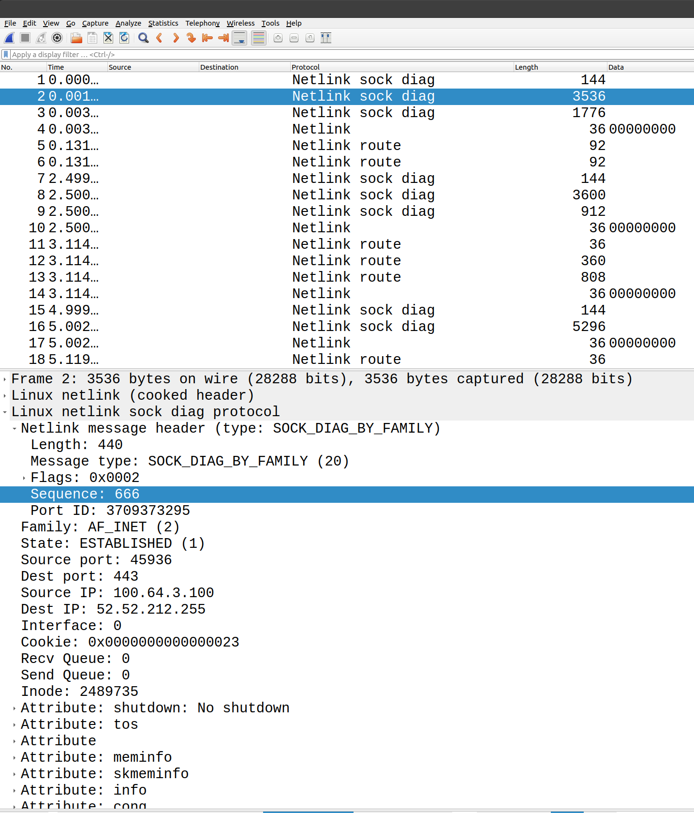

# Development comments

## Code Layout

File                                                                           | Summary             | Description
---                                                                            | ---                 | ---
[./cmd/xtcp.go](./cmd/xtcp.go)                                                 | Main()              | Main handles cli flags, has the poller, netlinker, and inetdiager code. Most code here. (Possibly these workers should be moved to their own .go or .go-s each)
[./pkg/inetdiag/inetdiag.go](./inetdiag.go)                                    | Types               | Type definitions based on the kernel structs
[./pkg/xtcpnl/xtcpnl.go](./xtcpnl/xtcpnl.go)                                   | xtcp`NL` = Netlink  | Netlink socket syscall related code.  (Opens sockets, Builds TCP diag request, send TCP diag request)
[./pkg/xtcppb/xtcppb.go](./xtcppb/xtcppb.proto)                                | xtcp`PB` = Protobuf | Protobuf has the xtcppb.proto and the generated xtcppb.pb.go
[./pkg/superinetdiag/superinetdiag.go](./superinetdiag/superinetdiag.go)       | Perf refator        | Start of code to do a more efficient decode of inetdiager as described above in "Further performance future work"
[./tools/xtcp_debug_server.go](./tools/xtcp_debug_server.go)                   | Test tool           | Small UDP server that will recieve marshalled protos and print them as JSON.  For quick testing and troubleshooting.
[./README.md](./README.md)                                                     | README.md           | This doc
[./Makefile](./Makefile)                                                       | Makefile            | Makefile
[.gitignore](./.gitignore)                                                     | gitignore           | Avoid pushing generates code and binaries to git
[.travis.yml](./.travis.yml)                                                   | Travis              | Travis CI/CD build file
[./go.mod](./.go.mod)                                                          | Go Modules          | Defines the list of modules used by this application
[./docs/notes](./notes)                                                        | Notes               | Detailed netlink inet_diag kernel notes
[./docs/digrams/xtcp_diagram.png](./docs/diagrams/xtcp_diagram.png)            | xtcp diagram        | Diagram of `xtcp`
[./docs/digrams/xtcp_sampling.png](./docs/diagrams/xtcp_sampling.png)          | xtcp diagram        | Diagram of sampling features within `xtcp`
[./docs/digrams/m-lab_tcp-info_diagram](./docs/diagrams/m-lab_tcp-info_diagram.png) | m-lab digram   | Diagram of m-lab TCP (https://github.com/m-lab/tcp-info)
[./tools/](./tools/)                                                           | Tools               | Some tools for testings


## Dependencies (as of July 2020)

* Specifically does NOT pull in random packages from github
* Relies almost exclusively on standard golang packages, and mostly just "golang.org/x/sys/unix"
* The main exception is the http://github.com/pkg/profile, which is the Dave Cheney profiling helpers
* Uses the standard Prometheus client golang library http://github.com/prometheus/client_golang/prometheus
* Does NOT use the https://github.com/statsd/statsd/tree/master/examples/go , because StatsD is so simple

## Dependency licenses

Dependancy                                           | License             | Link
---                                                  | ---                 | ---
Golang                                               | BSD                 | https://golang.org/LICENSE
github.com/go-cmd/cmd                                | MIT                 | https://github.com/go-cmd/cmd/blob/master/LICENSE
golang.org/x/sys v0.0.0-20210630005230-0f9fa26af87c  | BSD-3               | https://pkg.go.dev/golang.org/x/sys@v0.0.0-20210630005230-0f9fa26af87c?tab=licenses
github.com/golang/protobuf v1.5.2                    | BSD-3               | https://github.com/golang/protobuf/blob/master/LICENSE
google.golang.org/protobuf v1.27.0                   | BSD-3               | https://pkg.go.dev/google.golang.org/protobuf?tab=licenses
github.com/prometheus/client_golang v1.11.0          | Apache 2.0          | https://github.com/prometheus/client_golang/blob/master/LICENSE
github.com/pkg/profile v1.6.0                        | BSD                 | https://github.com/pkg/profile/blob/master/LICENSE


## Dependencies to add soon (as of July 2020)
* Stats libraries
* Maxmind database reader

## CLI flags
There are many CLI flags to control things like the number of workers of each type, polling frequency, etc.  For the full list look in main() or do "./xtcp -help".
The intention will be to have a systemd service file that monitors this process which would pass the suitable CLI flags, perhaps via xconfigs somehow.

***Please note the defaults compiled into the binary are very conservative. e.g. If somebody runs `xtcp` without arguments, it's pretty safe.***


The concurrency setup of xtcp could allow xtcp to process the messages really quickly by consuming lots of OS threads, however we probably don't need it to be so faster, and would prefer to actually serve customers.  Therefore, we should probably set https://golang.org/pkg/runtime/#GOMAXPROCS to a lowish number like 2-4.

Please note the flags get stuffed into a struct `"var cliFlags flags"` within main to allow them to be passed to the workers more easily, so they are essentially global state.

CLI flags shown here:

```
$ ./bundle/bin/xtcp --help
Usage of ./bundle/bin/xtcp:
  -defaults
    	show default configuration
  -frequency duration
    	Polling frequency. Default 30 seconds (default 30s)
  -goMaxProcs int
    	goMaxProcs = https://golang.org/pkg/runtime/#GOMAXPROCS
  -inetdiagerReportModulus int
    	inetdiagerReportModulus.  report every X inetd messages. Default 2000 (default 2000)
  -inetdiagers4 int
    	inetdiagers4, default 10 (default 10)
  -inetdiagers6 int
    	inetdiagers6, default 4 (default 4)
  -maxLoops int
    	Maximum number of loops, or zero (0) for forever.  Default 0
  -netlinkerChSize int
    	netlinkerChSize, Default 100 (default 100)
  -netlinkers4 int
    	netlinkers4, default 4 (default 4)
  -netlinkers6 int
    	netlinkers6, default 2 (default 2)
  -nlmsgSeq int
    	nlmsgSeq sequence number (start), which should be uint32 (default 666)
  -no4
    	no IPv4, default false = IPv4 enabled
  -no6
    	no IPv6, default false = IPv6 enabled
  -noStatsd
    	no noStatsd, default false = noStatsd enabled
  -packetSize int
    	netlinker packetSize.  buffer size = packetSize * packetSizeMply. Use zero (0) for syscall.Getpagesize(). Default = 0
  -packetSizeMply int
    	netlinker packetSize multiplier.  buffer size = packetSize * packetSizeMply.  Default = 8 (default 8)
  -profile.mode string
    	enable profiling mode, one of [cpu, mem, mutex, block]
  -promInetdiagerChSize int
    	promChSize is the channel size for the inetdiagerStaterCh, Default 100 (default 100)
  -promListen string
    	Prometheus http listening socket. Use 0.0.0.0:9000 for all interfaces. Default = 127.0.0.1:9000 (default "127.0.0.1:9000")
  -promNetlinkerChSize int
    	promChSize is the channel size for the netlinkerStaterCh, Default 10 (default 10)
  -promPath string
    	Prometheus http path. Default = /metrics (default "/metrics")
  -promPollerChSize int
    	promPollerChSize is the channel size for the pollerStaterCh, Default 4 (default 4)
  -samplingModulus int
    	samplingModulus.  Netlink sample socket every X inetdiag messages to send to inetdiager. Default 2 (default 2)
  -shutdownWorkers
    	shutdownWorkers, default false
  -single
    	Single means only one (1) of each worker type
  -statdDst string
    	Statds UDP socket destination. Default = 127.0.0.1:8125 (default "127.0.0.1:8125")
  -timeout int
    	Netlink socket timeout in milliseconds.  Zero(0) for no timeout.  Default 50 ms (default 50)
  -udpSendDest string
    	UDP socket send destination. Default = 127.0.0.1:13000 (default "127.0.0.1:13000")
  -version
    	show version
```

## Blast radius

This section briefly summarizes the `"blast radius"` of running xtcp and mitigations in place.

`xtcp` mostly just reads from a netlink socket and then writes out UDP packets.

However `xtcp` has the ability to sample netlink sockets at ***high frequencies*** and to generate ***many*** UDP packets.

Letting `xtcp` loose in such a way could not only put pressure on the Linux kernel, consume many userland resources, but also on the Kafka pipeline.

Therefore this section describes the resources consumed and controls put in place to avoid negative impacts.

### xtcp system calls:
- syscall.Socket()
    - `xtcp` opens a netlink socket per address family, so typically has x2 netlink sockets open
- syscall.SetsockoptTimeval()
    - When the netlink socket is created the the socket timeout is configured
- syscall.Getpagesize()
    - Is used to configure the size of the buffer to read the netlink socket data into userland
- syscall.Recvfrom()
    - Each netlinker, of which there are typically x2 address families (x4 of IPv4 and x2 for IPv6 = total 6 ) make the syscall.Recvfrom concurrently.
    - This is to drain the data out of the kernel as quickly as possible, and does mean the kernel has SetsockoptTimevals timers for each.
    - To minimize the number of syscalls, the buffer is set to 32KB, as described below.
    - If this is ever of concern the CLI flags `-netlinkers4` and `-netlinkers6` can be tuned, or use option `-single` to make xtcp only have a single worker of each type (although is still concurrent by address family)
- net.Dial()
    - Each inetdiager opens a UDP socket towards Kuda, the Kafka forwarder.
- udpConn.Write()
    - Each inetdiager writes to the UDP socket at a rate of `inetdiagMsgCount%*inetdiagerReportModulus == 0`.
    - For this reason the default inetdiagerReportModulus = 2000
    - Each of the `xStater` workers also send statsd messages via UDP. Becareful with decreasing the polling frequency, as the `inetdiager` summarizes the stats at 
- time.Now()
    - This isn't strictly a golang syscall, but it get's translated to a Linux syscall (TODO check)
    - This is called multiple times in the poller and in one (1) netlinker per polling cycle
- time.NewTicker()
    - The poller sets up a timer per address family. 

### xtcp currently does NOT:
- Open any files
- Open any TCP sockets
    - The intent is to add a HTTP web server to xtcp, but this is not currently implemented
For this reason it is easy to tightly restrict the system permissions.

### General controls
The general controls are:
- Tightly controlled by systemd: [xtcp.service](./bundle/systemd/xtcp.service)
    - Summary (not complete list)
        - LimitNPROC = 4
        - CPUWeight = 50 (default 100) 
        - Nice = 15
        - IOWeight = 50 (default 100)
        - MemoryHigh = 1500M
        - MemoryMax = 2G (this is higher than required)
- `xtcp` self limits [GOMAXPROCS](https://golang.org/pkg/runtime/#GOMAXPROCS)
- Light on memory because copying is limited by using pointers for many functions
- Sampling - see detailed section directly below
- pollingSafetyBuffer
    - `xtcp` has a cli flag .8 (80%) threshold that will generate standard output messages warnings when the polling loop is taking > 80% of the polling frequency.
    - Additionally the metric "long_poll" will increment when this happens.  Ideally alerting would be configured to check for this. TODO
    - Currently the default configuration is so conservative that this is extremely unlikely to happen. e.g. Polling takes <2s out of the possible 30s.


## Code quality

xtcp has been used in production since July 2021 and has proven to be stable 
and memory efficient.  However, the code could use a lot of refactoring, 
mostly breaking it up into more smaller functions.  This will improve readability, and the ability to write tests.

For the moment, this is a very basic outline to get the functionality, but definitely needs refactoring to improve it.

For example, the giant "switch" nlattr.NlaType statements could possibly be refactored into map lookups. Similarly, switch netlinkMsgHeader.Flags should be reduced by a map also.

The Prometheus and statsd stats definitely need improvements.

## Comments

We encourage comments, and so this code includes lots.

There's also examples of the structs from the kernel, and hopefully links to the kernel github source.  The intent is to make it easy for the reader to confirm what this code does makes sense.  It is likely // the kernel structs are going to change slightly in future, so having a reference of what the code, rather than searching.

## TODOs

There are many TODOs in the code and in this document. 

TODO.  Make priority list.  

## debugLevel constant variable

Throughout the code there is a `debugLevel` variable to do printf style debugging.

Perhaps a better longer term plan to solve this would be to expose a network RPC (gRPC streaming? to export debug messages.

## Using binary.reader rather than unsafe pointers

The design of this code is probably slower than using unsafe pointers and casting to types like we would do in C // (Please note the https://golang.org/src/syscall/netlink_linux.go does the unsafe pointers.) Instead, this code uses golang binary.reader which means we're doing data copies, but should be a lot safer I think this is the way the golang creators want us to do this because of the safety.

Please note that binary.Read returns the error is EOF only if no bytes were read. If an EOF happens after reading some but not all the bytes, Read returns ErrUnexpectedEOF.  (TODO update all the Read error handling to cover ErrUnexpectedEOF)
https://golang.org/src/encoding/binary/binary.go?s=5188:5251#L159

Please also note there's a func swapUint16 which is used by inetdiager to switch around the SocketID.(Source/Dest)Ports, because the kernel keeps those and only those in "__be16".

**WARNING.  This is NOT endian safe yet.  This will ONLY work on little endian.**

Shouldn't be hard to fix. TODO
1. Add test to check type on current machine.
2. Make variable for the binary.Read()s
3. Test on big endian machine

For BigE hardware maybe - ASUS Tinker Board S Quad-Core 1.8GHz SoC 2GB RAM 16GB eMMC storage, or qemu emulation of sparc64 or ppc64?

## Alignment (of types/structs)

Most of the netlink golang implementations essentially copy the C alignment macro code from the kernel.

xtcp implements a probably slower, but easier to read, method for doing the padding and alignment.  See section near comment "Calculate any  required padding".  (The padding is in the tail end of the inetdiager function.)

## Goroutines and copying

The code is also using multiple goroutines and passing data between them.  To pass the data requires copying,
so again this is likely to be slower because of the memory allocations, but does allow concurrency.

# Timespec

The protobuf messages that we're streaming to Kafka to the back office, include the syscall.Timespec (64 bit time with nanoseconds), but it was tricky to come up with a clean way to get the time to all the workers.

The design selected tries to minimize the number of time.Now() calls.

Therefore, after careful thought, the timeSpec is the time.Now() just before sending the netlink dump request message.  This means the timeSpec is the earliest time the TCP diag message could have been.

The netlinkers are started up with an argument that includes the start time, and they pass this over the channel to the inetdiagers with each inetdiagMsg.

TODO Try using the golang race detector to check there is no race, and need to check traces for signs of sync.RWMutex contention.  

Warning.  Please be careful that that there is syscall.Timespec and syscall.Timeval.  We're using Timespec, which has nanoseconds, and matches the kernel.

# shutdownWorkers

There is a cli flag that controls if the inetdiag workers get shutdown.

This was added to allow profiling which method is best, but now that both methods have been implemented

e.g. Depends on:
- Number of sockets in the machine
- Polling frequency.  E.g. If you want to only poll at perhaps 5 minutes, probably makes sense to close down.
- Numbers of workers
- etc

The main thing this feature does is cause the inetdiags to shutdown by `close(netlinkerCh)`

TODO - Do some profiling of various configurations and document to provide some guidance.

# All in one

As much as possible, this code is not pulling in other libraries.

For example, https://github.com/m-lab/tcp-info actually pulls in a tiny bit of https://github.com/vishvananda/netlink 

# Tests

Currently there are some very basic tests for the functions that were easy to test:
- xtcp_test.go
    - TestCheckNetlinkMessageTypes
    - TestSwapUint16
- xtcpnl_test.go
    - TestBuildNetlinkSockDiagRequest

The main challenge with the testing is that many functions are reading from channels, and/or using pointers.

It is likely a large refactor will be required to break the existing code up into something more simple to write tests fo

- netlinker() is tricky to test because it reads netlink from the kernel
maybe there's a way to split this into x2 functions, so a test netlink message could be read from a file for testing?

- inetdiager() reads from the channel, so possibly some "known good" netlink messages could be save into the tests directory, and fed in somehow.  Got to look at the best way to test functions that read channels.

By breaking the code into smaller functions it should be easier to write tests.  

One major challenge is to capture socket data from a live system, and then somehow ensure the parsing it correct for this, then use this for the tests.  Possibly an approach for testing might be to use an alternative netlink message parser like the one from https://github.com/vishvananda/netlink , so at least it would be possible to detect if xtcp parsing differs, and would allow a performance comparision.


Testing has been performed on Ubuntu 20.04, Ubuntu 16.04 & 18.04, including on many machines with >100k sockets.

The debug output has also been carefully compared to the netlink packets as decoded by Wireshark.  To perform this analysis, netlink packets were captured by performing the following steps:

```
# Load module
modprobe nlmon
sudo modprobe nlmon

# Check module is loaded
lsmod | grep nlmon

# Add the new nlmon interface
sudo ip link add nlmon0 type nlmon
sudo ip link set dev nlmon0 up

# Now TCPdump
sudo tcpdump -i nlmon0 -w netlink.pcap
sudo chown das:das *.pcap
```

Screenshot showing the netlink INET DIAG response message.

Things to note in the screenshot:
- Netlink message header shows the sequence number
- inet_diag_req_v2 struct contents including source+dest IPs and ports is visible
- List to the socket attributes is shown
- Netlink route message are NOT `xtcp` related.  (TODO investigate)



# protobufs

The proto definitions are in v2, not v3, but does use the modern protobuf v2 API.

**Protobufs needs to move to the shared repo TODO**

Using Golang the protobufs v2 API, which lives here:

- github.com/golang/protobuf module is APIv1.
- google.golang.org/protobuf module is APIv2.    <-- Using this one

Documentation can be found here: https://pkg.go.dev/google.golang.org/protobuf?tab=overview

Read more about v2 here: https://blog.golang.org/protobuf-apiv2

Note - protobuf has both an optional congestionControl string and enum.  Recommend using the enum, but the string is there in case it's needed quickly for another algorithm.

### Usage of APIv2
Make sure to install the latest protoc-gen-go via:
go install google.golang.org/protobuf/cmd/protoc-gen-go


```bash
sudo apt install protobuf-compiler
sudo apt install golang-goprotobuf-dev
```


```bash
sudo mv /usr/bin/protoc-gen-go /usr/bin/protoc-gen-go.not
export PATH=~/go/bin:$PATH
```
https://developers.google.com/protocol-buffers/docs/reference/go-generated#package

There is also a gitlab ci/cd file.

### Tools - xtcp_udp_server_example.go

There is a very small UDP server that will recieve marshalled protobufs, unmarshall, and print out as json.  This is just for testing the `xtcp` is working, and if you want to see the json coming out this is a way to watch.

If you are trying to run this locally on a machine with a small number of sockets, set the `inetdiagerReportModulus` to 1, so that every message is sent via UDP

```bash
./xtcp -inetdiagerReportModulus 1
```

# Inspired by

This code is heavily inspired by:

Reference                              | Description of help
---                                    | ---
https://github.com/shemminger/iproute2 | `ss` tool
https://github.com/vishvananda/netlink | Doesn't handle full dump (yet), but is an excellent golang library
https://github.com/m-lab/tcp-info      | Designed for very fine grained TCP analysis, and moved away from protobufs (uses vishvananda/netlink)

m-lab has a very high frequency (15 ms) polling loop and detects changes to the sockets between polling cycles. 

Special thanks and shout-outs to all of these open source contributors! 
