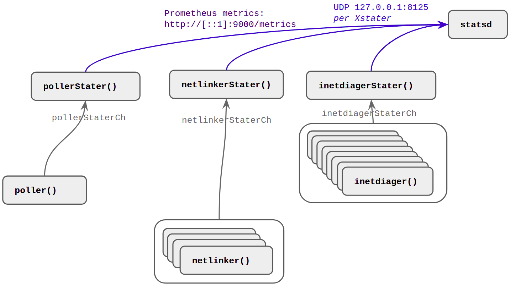
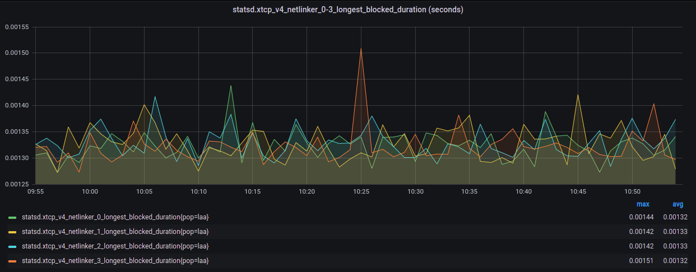
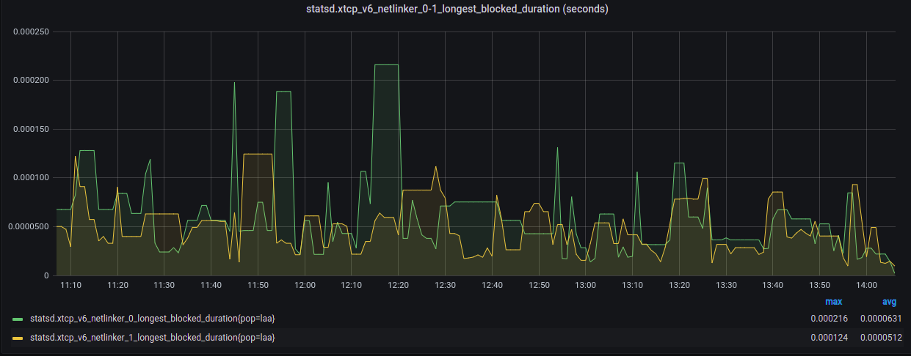
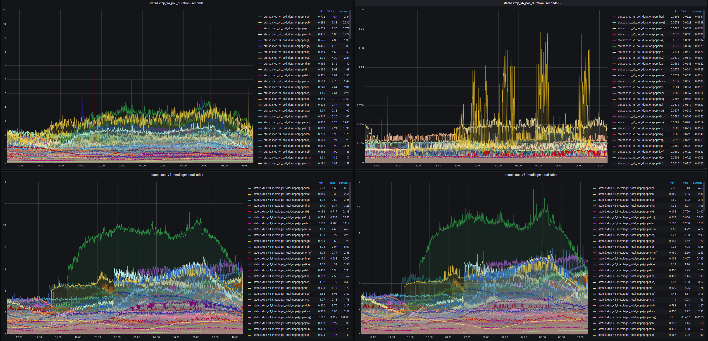

## pollerStater, netlinkerStater, & inetdiagStater
`xtcp` has detailed metrics about the internal workings made available via:
- [Prometheus](https://prometheus.io/) at the default location of http://127.0.0.1:9000/metrics (CLI options to change)
- Most statistics are also sent to [statsd](https://github.com/statsd/statsd), and can be optionally disabled by `noStatsd` flag.
  - The Statistics NOT sent to statsd are:
    - Duration histograms
    - Stats about sending to statsd

Mostly to support sending summarized increments to [statsd](https://github.com/statsd/statsd), summary statistics from each worker are sent to a didicated xStater per worker type.  The workers are responsible for incrementing the Prometheus counters, and sending to statsd.  One key advantage of having these workers is the small `"i++"` metric increments are isolated within the worker itself (races impossible), and so the Promethus atomic variable updates are performed in larger single steps less frequently.


### Stats overview diagram
The following diagram shows the compoents of `xtcp` dedicated to the statistcs system



The following table summarizes the xStater workers


xStater           | Channel              | Summarization Method            | Comment
---               | ---                  | ---                             |---
pollerStater      | pollerStaterCh       | Poll cycle competion            | Duration histograms for done and poll (expensive) is available
netlinkerStater   | netlinkerStaterCh    | Netlinker exit                  | Duration histograms when the channel to inetdiagers is blocked is available
inetdiagStater    | inetdiagerStaterCh   | Timer at % pollingFrequency     | Counter for when the inetdiagerStaterCh channel is blocked is available
                  |                      |                                 | Please note that inetdiagStater calculates differences between the stats samples


To see the `xtcp` Prometheus metrics simply perform:

```
curl -s http://127.0.0.1:9000/metrics 2>&1 | grep -v "#"
```

### Metrics based troubleshooting
There are potentially too many metrics, as there are available metrics cover the inputs and outputs of all the key workers.  The idea of this was that if some kind of internal error occurs, then the input and output counters will not match, so when troubleshooting this is a good place to start.  Recommended troubleshooting techniques include:
- Dashboards of the in verse out metrics should quickly identify where errors are happening
- The "blocked" metrics and duration summaries should also help understand if/where there's a performance problem
  - Please note that currently we definitely see a LOT of netlinker -> inetdiager blocking occuring, which is NORMAL and actually ok.  This could be improved, but ultimately given the inetdiagers need to do more work that netlinkers, there's always going to be blocking.

### Statsd UDP warning
When using UDP, it is recommended to increase UDP buffers for the kernel. e.g. Settings like the following will reduce the chance of UDP packet losses.  
```
    net.core.rmem_max: 20971520
    net.core.rmem_default: 3495200
```
Please keep in mind that the `inetdiagers` send stats at a percentage (%) of the pollingFrequencySeconds, so if the polling frequency is very short, then the statsd UDP message rate could become large.  The default percentage is 0.9, meaning 90%, of the pollingFrequencySeconds.

### Metrics available
There are approximately ~300 variables exposed to Prometheus:
```
$ curl -s http://127.0.0.1:9000/metrics 2>&1 | grep -v "#" | wc -l
271
$ curl -s http://127.0.0.1:9000/metrics 2>&1 | grep -v "#" | grep "id=\"0"
xtcp_inetdiager_in{af="v4",id="0"} 4.98992032e+08
xtcp_inetdiager_in{af="v6",id="0"} 8.86897296e+08
xtcp_inetdiager_msgs{af="v4",id="0"} 1.175601e+06
xtcp_inetdiager_msgs{af="v6",id="0"} 2.051731e+06
xtcp_inetdiager_pad{af="v4",id="0"} 5.4077646e+07
xtcp_inetdiager_pad{af="v6",id="0"} 1.00534819e+08
xtcp_inetdiager_read{af="v4",id="0"} 4.04406744e+08
xtcp_inetdiager_read{af="v6",id="0"} 7.22209312e+08
xtcp_inetdiager_stats_blocked{af="v4",id="0"} 0
xtcp_inetdiager_stats_blocked{af="v6",id="0"} 0
xtcp_inetdiager_udp_bytes{af="v4",id="0"} 1.89430481e+08
xtcp_inetdiager_udp_bytes{af="v6",id="0"} 3.55532109e+08
xtcp_inetdiager_udp_errors{af="v4",id="0"} 587487
xtcp_inetdiager_udp_errors{af="v6",id="0"} 1.025542e+06
xtcp_inetdiager_udps{af="v4",id="0"} 1.175601e+06
xtcp_inetdiager_udps{af="v6",id="0"} 2.051731e+06
xtcp_netlinker_blocked{af="v4",id="0"} 0
xtcp_netlinker_blocked{af="v6",id="0"} 0
xtcp_netlinker_errors{af="v4",id="0"} 0
xtcp_netlinker_errors{af="v6",id="0"} 0
xtcp_netlinker_in{af="v4",id="0"} 1.47454e+06
xtcp_netlinker_in{af="v6",id="0"} 1.421736e+06
xtcp_netlinker_msgs{af="v4",id="0"} 3545
xtcp_netlinker_msgs{af="v6",id="0"} 3955
xtcp_netlinker_nasty{af="v4",id="0"} 20
xtcp_netlinker_nasty{af="v6",id="0"} 0
xtcp_netlinker_out{af="v4",id="0"} 1.417008e+06
xtcp_netlinker_out{af="v6",id="0"} 1.355184e+06
xtcp_netlinker_packets{af="v4",id="0"} 445
xtcp_netlinker_packets{af="v6",id="0"} 1131
xtcp_netlinker_read{af="v4",id="0"} 1.417008e+06
xtcp_netlinker_read{af="v6",id="0"} 1.355184e+06
```

The golang runtime stats are exposed only within Prometheus (NOT statsd), including the golang go_gc_blah and go_memestats, etc:
```
$ curl -s http://127.0.0.1:9000/metrics 2>&1 | grep -v "#" | grep go_
go_gc_duration_seconds{quantile="0"} 3.5054e-05
go_gc_duration_seconds{quantile="0.25"} 8.5364e-05
go_gc_duration_seconds{quantile="0.5"} 0.000132477
go_gc_duration_seconds{quantile="0.75"} 0.00020701
go_gc_duration_seconds{quantile="1"} 0.006554919
go_gc_duration_seconds_sum 0.043782696
go_gc_duration_seconds_count 166
go_goroutines 27
go_info{version="go1.15.2"} 1
go_memstats_alloc_bytes 2.749776e+06
go_memstats_alloc_bytes_total 4.43753776e+08
go_memstats_buck_hash_sys_bytes 1.469772e+06
go_memstats_frees_total 5.220806e+06
go_memstats_gc_cpu_fraction 2.6840394767777394e-05
go_memstats_gc_sys_bytes 4.997712e+06
go_memstats_heap_alloc_bytes 2.749776e+06
go_memstats_heap_idle_bytes 6.2316544e+07
go_memstats_heap_inuse_bytes 4.005888e+06
go_memstats_heap_objects 17249
go_memstats_heap_released_bytes 6.1947904e+07
go_memstats_heap_sys_bytes 6.6322432e+07
go_memstats_last_gc_time_seconds 1.6003035056399987e+09
go_memstats_lookups_total 0
go_memstats_mallocs_total 5.238055e+06
go_memstats_mcache_inuse_bytes 6944
go_memstats_mcache_sys_bytes 16384
go_memstats_mspan_inuse_bytes 95472
go_memstats_mspan_sys_bytes 114688
go_memstats_next_gc_bytes 4.194304e+06
go_memstats_other_sys_bytes 824420
go_memstats_stack_inuse_bytes 786432
go_memstats_stack_sys_bytes 786432
go_memstats_sys_bytes 7.453184e+07
go_threads 13
```

TODO - Improve concurrency by having more stats workers

TODO - Leverage the Prometheus "registry" for calculating differences.

TODO - Move the stater workers to their own submodule

TODO - Consider exposing https://golang.org/pkg/expvar/ , because `xtcp` already had many great counters, so this approach might actually be a cleaner solution, although potentially expvar is less performance than the Prometheus client (the Prometheus client doco mentions this, but they would say that wouldn't they?)

## Further performance future work

TODO Pass array/slice of INET_DIAG messages from netlinkers to inetdiagers, rather than a single message at a time.

For example, in production the netlinker to inetdiager channel is regurly getting blocked.


Here we see the maximum blocked times.





Speeding up that up should improve the poll durations.



TODO Explore if slices for handling the netlink packet data could be used for everything, to avoid the binary reads

TODO Make the code less flexible?

This code is really based on the very flexible code inside iproute2 ss command, which was built to essentially handle any netlink messages coming back in an elegant way.  Therefore, the code is pretty robust in terms of it's parsing approach, as it gradually works through each little part of the messages.  During testing Inet_diag messages come back in the same order every time. e.g. Message types 8,5,17,1,7,2,4,16 come back in this order every time.  The padding is also the same every time.

Therefore, it is likely that some of the safety could be reduced, in favor of speed, by exploiting this behavior and doing larger direct mapping into structs.  Warning, that the order might change with a new kernel, so you would need to keep the safe code around to re-determine the order again if the order changes.

The trick is that in a couple of the fields like type 4 INET_DIAG_CONG, the congestion control algorithm" is a variable length C string, so the entire message can't be decoded in a single shot.  Similarly, the type 16 INET_DIAG_BBRINFO is only present for sockets with BBR, so again, this will need to be decoded selectively.

Some of this work has been started in the "superintdiag.go"

<!--
xtcp can be run in a container via:
```
docker run --network=host -v ~/data:/home/ -it xtcp -prom=4000
```
-->

# Profiling capabilities

Main() has CLI flag to allow enabling of the various types of profiling.  This is leveraging the Dave Cheney pprof ease of use library: github.com/pkg/profile

TODO - Do some tracing.

See also: https://dave.cheney.net/2013/07/07/introducing-profile-super-simple-profiling-for-go-programs